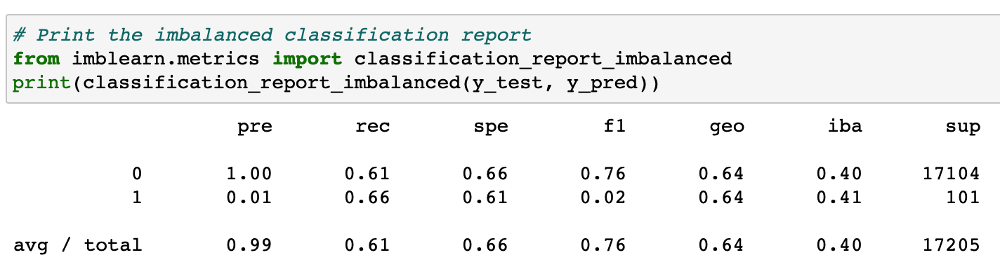

# Credit Risk Analysis
The objective of this analysis was to identify the best machine learning model that would predict if a loan applicant is high risk.  A number of machine learning algorithms were tested to find which one performed the best.  

## Results

### Random Oversampling
* Balanced Accuracy: 0.63
* Precision: 0.01
* Recall: 0.66

### SMOTE Oversampling
* Balanced Accuracy: 0.66
* Precision: 0.01
* Recall: 0.62

### Under Sampling
* Balanced Accuracy: 0.66
* Precision: 0.01
* Recall: 0.69

### Combination Sampling
* Balanced Accuracy: 0.54
* Precision: 0.01
* Recall: 0.79

### Balanced Random Forest Classifier
* Balanced Accuracy: 0.77
* Precision: 0.03
* Recall: 0.64

### Easy Ensemble AdaBoost Classifier
* Balanced Accuracy: 0.91
* Precision: 0.05
* Recall: 0.93

## Summary
The Easy Ensemble AdaBoost model performed the best out of all of the options tested.  It scored the best across balanced accuracy, precision, and recall.  However, the precision scores are still very low.  Boosting did help improve the precision scores by a signicant amount, but there is only so much that process can help with such an imbalanced data set.  If the priority is to be conservative, then I would recommend using the Easy Ensemble AdaBoost model.  You would get a high number of false positives, but you would reduce the amount of loans given to high risk borrowers.  
